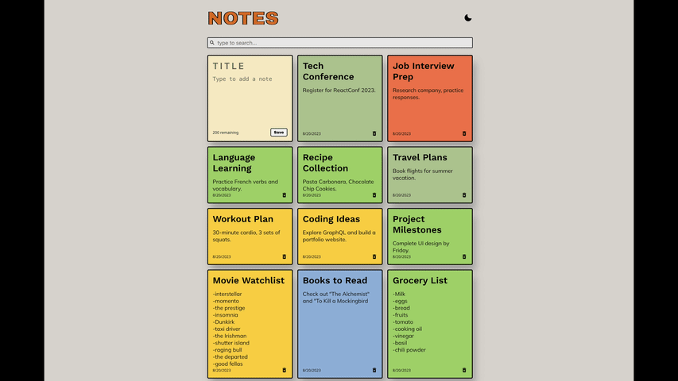

# React Notes App

A local-first sticky-note board with rich text editing, folders, tasks, web clips, and playful motion.


## Preview

**Live demo:** [React-Notes-App](https://react-notes-app-five-dusky.vercel.app)




> Note: refresh the screenshot and GIF before publishing if they still show the older, simpler interface.

## Overview

React Notes App is a local-first notes board that keeps the tactile personality of sticky notes while adding the structure expected from a more capable notes tool. It supports rich editing, folders, tags, smart filters, due dates, reminders, and web clips without requiring an account or backend.

The app keeps its scrapbook-style design DNA: colorful cards, thick borders, bold typography, dark mode, and subtle Framer Motion transitions that make notes feel like they are being placed, pinned, opened, and removed from a board.

All note data is stored locally in the browser with IndexedDB, with a legacy `localStorage` migration path for older saved boards. That keeps the project simple to run and deploy as a static GitHub Pages app while giving the app a better storage foundation for future attachments and backups.

## Features

### Writing & Editing

- Add quick notes from the board.
- Open a full rich-text editor modal for new or existing notes.
- Format notes with Tiptap-powered bold, italic, underline, headings, lists, checklists, code, code blocks, links, undo, and redo.
- Choose from an expanded sticky-note color palette.
- Save title-only or body-only notes with an `Untitled` fallback.
- Protect unsaved edits with a discard confirmation.

### Organization

- Create, rename, delete, and color manual folders.
- Move notes into folders from the editor modal.
- Use smart folders for All Notes, Pinned, Tasks, Web Clips, Overdue, and Archive.
- Add tags and filter the board with tag chips.
- Pin important notes to the top of the board.
- Archive notes without permanently deleting them.
- Sort notes by recently edited, newest first, or A-Z.

### Productivity

- Extract task data from rich-text checklists.
- Show task progress badges on note cards.
- Add due dates and surface overdue task states.
- Store reminder dates on notes.
- Save web clips from pasted URLs.
- Enrich web clips with Open Graph metadata when available, with a safe fallback to the bare URL/domain.

### Search

- Search across note titles, rich-text plain text, tags, task labels, and clip metadata.
- Rank substring matches by relevance.
- Highlight matching text in note titles and previews.

### Experience

- Animated cards, modals, sidebar interactions, and empty states with Framer Motion.
- Polished light and dark modes.
- Responsive sidebar with mobile navigation.
- Confirmation dialogs for destructive actions.
- Accessible labels on icon controls and dialog semantics for modals.

### Persistence

- Store notes, settings, and folders locally in the browser with IndexedDB.
- Migrate old notes from the original `{ id, title, text, date, randomBackgroundColor }` shape.
- Import existing legacy `localStorage` data into IndexedDB on first run after upgrade.
- Run as a static app with no backend required.

## Tech Stack

- **React 18** for the UI.
- **Vite** for local development and production builds.
- **Tiptap** for rich text editing.
- **Framer Motion** for tactile UI animation.
- **date-fns** for date formatting and overdue checks.
- **react-icons** for interface icons.
- **nanoid** for note and folder IDs.
- **Vitest + React Testing Library** for unit coverage.
- **IndexedDB** for local-first persistence, with legacy `localStorage` fallback/migration.

## Architecture

The app is organized around an `AppProvider` with reducer-based state for notes, folders, settings, search, sorting, and active filters. Persistence is handled through IndexedDB, with migration utilities that upgrade older note data into the current rich-note shape and import existing `localStorage` boards.

Search and folder behavior live in focused hooks, including `useSearch`, `useSmartFolders`, and folder-count helpers. The main UI is split into reusable components such as `Sidebar`, `Header`, `NoteBoard`, `NoteCard`, `NoteModal`, `ClipModal`, and confirmation dialogs.

Motion settings are centralized through shared animation utilities so card entrance/exit, layout shuffling, modal transitions, and reduced-motion behavior stay consistent.

## Getting Started

```bash
git clone https://github.com/Tanvi-1432/React-Notes-App.git
cd React-Notes-App
npm install
npm start
```

The app will run at [http://localhost:5173/React-Notes-App/](http://localhost:5173/React-Notes-App/) by default.

## Available Scripts

```bash
npm start
```

Runs the app in development mode.

```bash
npm test
```

Runs the test suite once.

```bash
npm run build
```

Builds the production app into the `dist` folder.

```bash
npm run deploy
```

Builds and deploys the app to GitHub Pages using the configured `homepage` in `package.json`.

## Testing

Current verified test result:

- 8 test suites passed
- 72 tests passed
- 0 snapshots

Coverage currently includes:

- note migration from the old app shape
- IndexedDB/localStorage fallback migration
- reducer behavior
- Tiptap helper utilities
- task extraction
- ranked search
- smart folder counts and filters
- highlighted search text

Run the suite with:

```bash
npm test
```

## Data & Privacy

React Notes App is local-first. Notes, folders, and settings are stored in the browser with IndexedDB.

- No account is required.
- No backend or cloud database is used.
- No cross-device sync exists yet.
- Existing legacy `localStorage` data is migrated into IndexedDB when the app first loads after upgrade.
- Clearing browser storage can delete saved notes.
- Web clip metadata lookup uses a CORS proxy and falls back safely if metadata cannot be fetched.

## Current Limitations

- Attachments are not implemented yet.
- OCR search for images and PDFs is not implemented yet.
- Reminder dates are saved, but browser notifications are not fired yet.
- Notes do not sync across devices.
- There is no backend, export/import flow, or cloud backup yet.
- Web clip metadata depends on public page availability and CORS/proxy behavior.

## Roadmap

- Add attachments for images, PDFs, and richer link previews.
- Add OCR for image/PDF search.
- Add JSON export/import for backups and migration.
- Add service-worker-powered reminder notifications.
- Build a browser extension clipper.
- Explore optional backend/cloud sync.

## Accessibility

The upgraded app includes accessible labels for icon-only controls, semantic dialogs for modals and confirmations, keyboard support for note cards and folder items, focus handling inside editor dialogs, responsive navigation, and reduced-motion-aware animation utilities.

## Deployment

This project is configured for GitHub Pages. The deployment target is set with the `homepage` field in `package.json`.

```bash
npm run deploy
```

The deploy script runs a production build and publishes the `dist` directory through `gh-pages`.

## Contributing

Contributions are welcome.

1. Fork the repository.
2. Create a feature branch.
3. Install dependencies with `npm install`.
4. Make your changes.
5. Run `npm test`.
6. Open a pull request with a clear summary.

## License

This project is licensed under the [MIT License](LICENSE).
